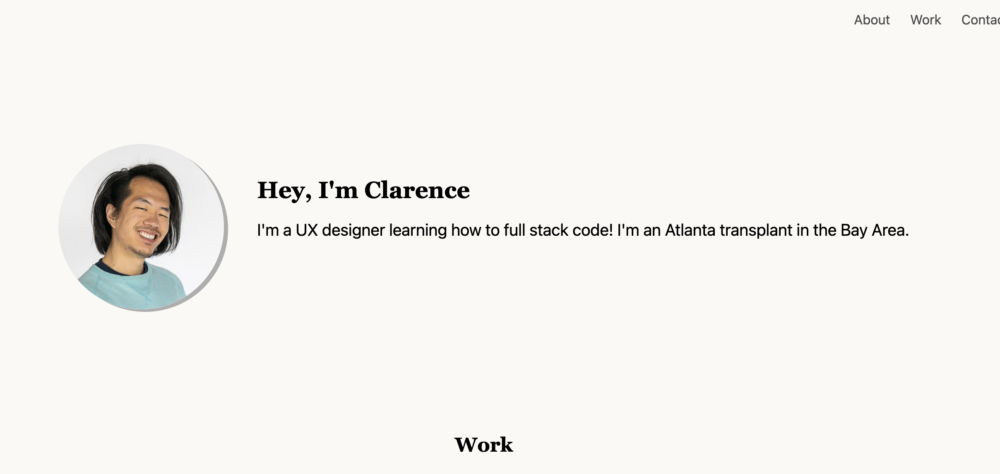

# module-2-challenge

##Description

This repository is for the module 2 challenge of creating our own class portfolio.

The goal for this assignment is to load portfolio that is the following: 

- Mobile responsive
- Contains a picture or avatar of the developer
- A list of projects being worked upon 
- Contact information of the dev 

[Link](https://hiclarence.github.io/class-portfolio/)

- test from Biteline